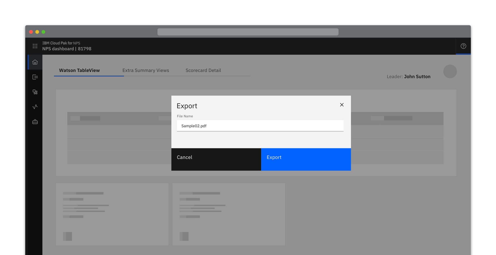
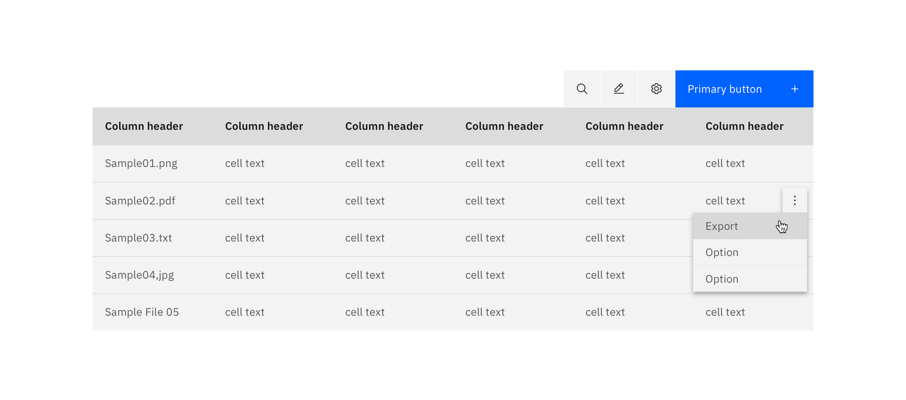
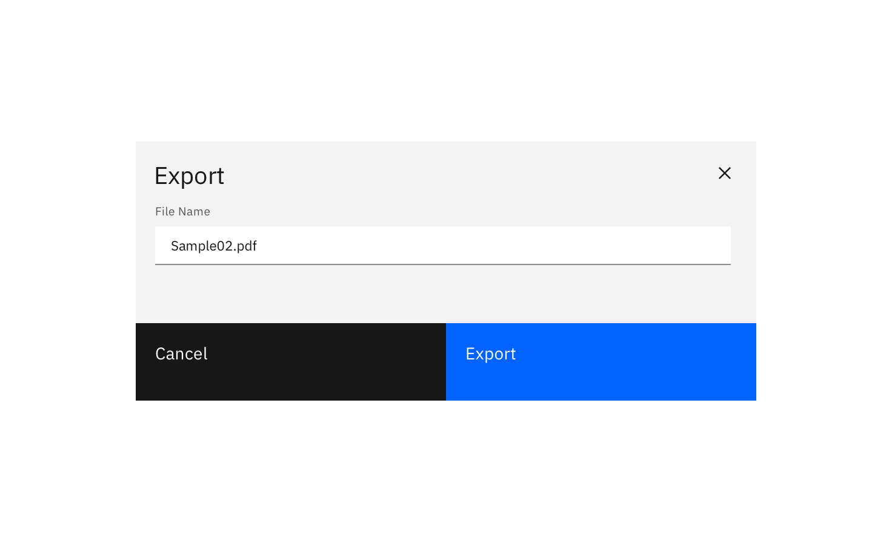
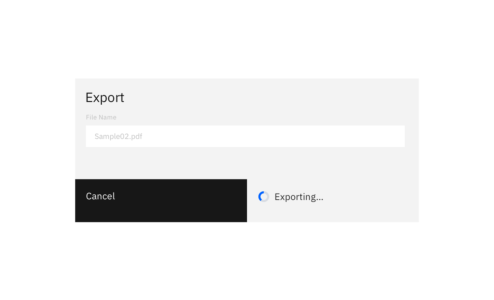

### Exporting a resource saves the data in a location external to the application.

#### Status: 

Experimental

#### Maintainers:

[Vikki Paterson](https://github.ibm.com/VICTORIA), [Arnaud Gillard](https://github.ibm.com/Arnaud-Gillard)

<AnchorLinks>

- [Intuitive default name](#intuitive-default-name)
- [Editable name](#editable-name)
- [Export to specific location](#export-to-specific-location)

</AnchorLinks>

<ImageComponent cols="12" caption="Example of a export pattern using a modal">

</ImageComponent>

## On-click export

Sometimes, an applicaiton will provide an export option that adheres to the system default for downloaded files. Export occurs on-click, with no further options provided. If this is the case, the file should be given an intuitive name to ensure the user can locate the file.

<ImageComponent cols="12">

</ImageComponent>

** DO/DONT EXAMPLE **

## Editable name

When exporting with an editable name, a dialog should be presented to the user displaying an editable textbox pre-populated with the default name for the file.

<ImageComponent cols="12">

</ImageComponent>

<ImageComponent cols="12">

</ImageComponent>

## Export to specific location

To specify the export location of a resource, the a user selects the “download” button and activates the browsers default location panel. The file is automatically downloaded once a location is selected.